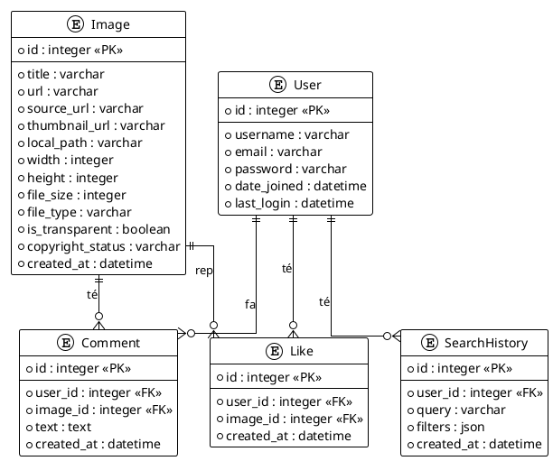
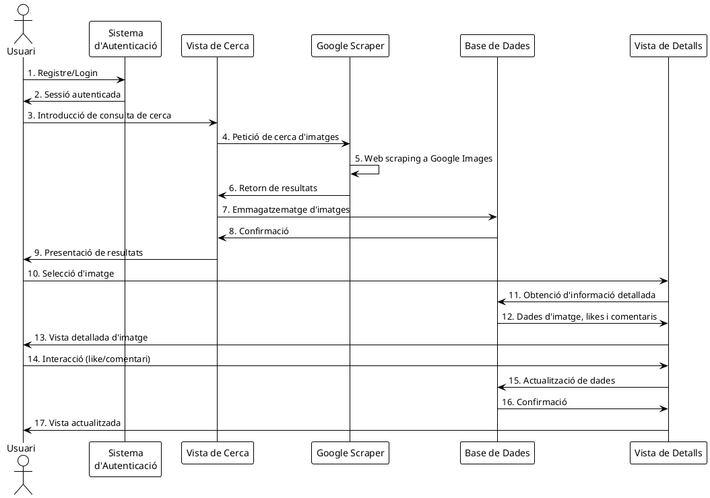

# Documentació Tècnica - Django Image Scraper

## Estructura del Projecte

El projecte Django Image Scraper està organitzat seguint la estructura estàndard d'una aplicació Django, amb algunes personalitzacions per integrar l'ús de TailwindCSS i components frontend addicionals. La arquitectura combina un backend tradicional Django amb una API REST.

```
django-image-scraper/
│
├── image_scraper/                # Configuració principal del projecte Django
│   ├── settings.py              # Configuracions del projecte
│   ├── urls.py                  # Definicions d'URL globals
│   ├── wsgi.py                  # Configuració WSGI per a deployment
│   └── asgi.py                  # Configuració ASGI per a serveis asíncrons
│
├── scraper/                      # Aplicació principal de scraping
│   ├── migrations/              # Migracions de la base de dades
│   ├── admin.py                 # Registre de models a l'admin de Django
│   ├── apps.py                  # Configuració de l'aplicació
│   ├── forms.py                 # Formularis del projecte
│   ├── models.py                # Models de dades
│   ├── urls.py                  # Definicions d'URL específiques de l'aplicació
│   ├── views.py                 # Vistes HTML i lògica de control
│   ├── api_views.py             # Vistes per a l'API REST
│   ├── serializers.py           # Serialitzadors per a l'API REST
│   ├── utils.py                 # Funcions d'utilitat general
│   ├── google_scraper.py        # Lògica específica de scraping de Google
│   └── api_service.py           # Implementació alternativa amb APIs d'imatges
│
├── templates/                    # Plantilles HTML
│   ├── scraper/                 # Plantilles específiques de l'aplicació
│   │   ├── base.html            # Plantilla base
│   │   ├── index.html           # Pàgina principal
│   │   ├── image_detail.html    # Vista detallada d'imatge
│   │   ├── profile.html         # Perfil d'usuari
│   │   ├── advanced_search.html # Cerca avançada
│   │   └── signup.html          # Registre d'usuari
│   │
│   └── registration/            # Plantilles d'autenticació
│       └── login.html           # Pàgina d'inici de sessió
│
├── static/                       # Recursos estàtics
│   ├── css/                     # Arxius CSS
│   └── js/                      # JavaScript
│       └── main.js              # Funcions JS principals
│
├── media/                        # Arxius carregats pels usuaris
│   └── images/                  # Imatges descarregades
│
├── theme/                        # Configuració de Tailwind CSS
│   └── static_src/              # Arxius font per a Tailwind
│
├── components/                   # Components UI (React/shadcn)
│   └── ui/                      # Components d'interfície d'usuari
│
├── manage.py                     # Script de gestió de Django
├── requirements.txt              # Dependències de Python
└── README.md                     # Documentació del projecte
```

## Mòduls Utilitzats

### Mòduls Natius de Python/Django

1. **Django Framework (4.2.7)**
   - **django.contrib.auth**: Sistema d'autenticació d'usuaris
   - **django.shortcuts**: Funcions d'ajuda per a vistes
   - **django.db.models**: ORM per a la gestió de la base de dades
   - **django.forms**: Sistema de formularis
   - **django.urls**: Gestió d'URLs
   - **django.views**: Sistema de vistes
   - **django.core.paginator**: Sistema de paginació

2. **Python Standard Library**
   - **json**: Processament de dades JSON
   - **re**: Expressions regulars per a extracció de dades
   - **io**: Operacions d'entrada/sortida
   - **os**: Interacció amb el sistema operatiu
   - **time**: Funcions relacionades amb el temps
   - **random**: Generació de nombres aleatoris
   - **logging**: Sistema de registre

### Mòduls Externs

1. **Web Scraping i Processament de Dades**
   - **BeautifulSoup (4.x)**: Parser HTML/XML per a web scraping
   - **requests**: Client HTTP per a realitzar peticions web
   - **Pillow (PIL)**: Processament i manipulació d'imatges

2. **Frontend**
   - **TailwindCSS**: Framework CSS d'utilitats
   - **django-tailwind**: Integració de Tailwind amb Django

3. **Components UI (preconfigurats però no completament integrats)**
   - **shadcn/ui**: Components d'interfície d'usuari basats en React
   - **React**: Biblioteca JavaScript per construir interfícies d'usuari
   - **Next.js**: Framework React per a aplicacions web

## Models de Dades



## Flux de l'Aplicació




### Vistes Web (HTML)

Aquestes són les vistes tradicionals de l'aplicació web que retornen pàgines HTML completes:

- `GET /`: Pàgina principal de cerca (index)
- `GET /image/{id}/`: Vista detallada d'una imatge
- `POST /image/{id}/like/`: Afegir/eliminar "m'agrada" via AJAX
- `POST /image/{id}/comment/`: Afegir un comentari via formulari
- `GET /profile/`: Perfil d'usuari
- `GET /advanced-search/`: Formulari de cerca avançada
- `GET/POST /signup/`: Registre de nou usuari
- `/admin/`, `/accounts/login/`, `/accounts/logout/`: Vistes d'autenticació de Django

### Formats de Resposta

#### API REST


## ApiRest. Per accedir als continguts de la api rest, procedir a fer curl o en el navegador:

Autenticació y perfil
• POST /api/register/ – Registre
• GET /api/profile/ – Dades d'usuari

CRUD imágenes (Django REST Framework ViewSet)
• GET /api/images/ – Llistar imatges
• POST /api/images/ – Crear imatge
• GET /api/images/{id}/ – Detall de imatge
• PUT /api/images/{id}/ – Reemplaç imatge
• PATCH /api/images/{id}/ – Actualitzar parcialment
• DELETE /api/images/{id}/ – Borrar imatge

Acciones custom sobre imágenes
• GET /api/images/search/?query=… – Cerca imatges
• GET /api/images/{id}/comments/ – Listar comentaris d'una imatge
• POST /api/images/{id}/comment/ – Añadir comentario (autenticat)
• POST /api/images/{id}/like/ – Marcar/desmarcar “magrada” (autenticat)

CRUD comentaris, likes i historial
• GET/POST/PUT/PATCH/DELETE /api/comments/ – CRUD comentaris
• GET/POST/PUT/PATCH/DELETE /api/likes/ – CRUD likes
• GET/POST/PUT/PATCH/DELETE /api/history/ – CRUD historial de cerca

Vistes web
• GET / – Página de búsqueda (index)
• GET /image/{id}/ – Detall d'imatge
• POST /image/{id}/like/ – Like vía AJAX
• POST /image/{id}/comment/ – Comentari via formulari
• GET /profile/ – Perfil web
• GET /advanced-search/ – Cerca avançada (formulari)
• GET/POST /signup/ – Registre de usuari
• /admin/, /accounts/login/, /accounts/logout/… (autenticació Django)


- **JSON**: Tots els endpoints de l'API REST retornen respostes en format JSON:
  
  Exemple de resposta d'una imatge:
  ```json
  {
    "id": 42,
    "title": "Resultado para: test",
    "url": "https://example.com/image.jpg",
    "source_url": "https://www.google.com/search?q=test&tbm=isch",
    "thumbnail_url": "https://example.com/thumbnail.jpg",
    "is_transparent": false,
    "copyright_status": "unknown",
    "width": 800,
    "height": 600,
    "file_size": 102400,
    "file_type": "jpg",
    "created_at": "2025-05-01T12:34:56.789Z",
    "likes_count": 5,
    "comments_count": 3
  }
  ```

  Exemple de resposta d'una acció de "m'agrada":
  ```json
  {
    "liked": true,
    "likes_count": 5
  }
  ```

#### Vistes Web

- **Pàgines HTML**: Totes les vistes web retornen pàgines HTML renderitzades amb Tailwind CSS.
- **AJAX**: Algunes funcionalitats com "m'agrada" utilitzen AJAX per actualitzar contingut sense recarregar la pàgina.

### Funcions de Web Scraping

El cor del sistema és el motor de scraping que extreu imatges de Google Images:

```python
def scrape_google_images(query, copyright_filter=None, transparent_only=False, max_results=20):
    """
    Cerca imatges a Google Images basant-se en la consulta i filtres proporcionats.
    Utilitza múltiples estratègies d'extracció per garantir resultats.
    
    Paràmetres:
    - query (str): Terme de cerca
    - copyright_filter (str): Filtre de drets d'autor (free, commercial, etc.)
    - transparent_only (bool): Si només s'han de retornar imatges amb transparència
    - max_results (int): Nombre màxim de resultats a retornar
    
    Retorna:
    - list: Llista de diccionaris amb informació de les imatges trobades
    """
```

## Instruccions de Desplegament

### Desplegament en Entorn de Desenvolupament

1. **Preparació de l'entorn**

   ```bash
   # Clonar el repositori
   git clone <url-repositori>
   cd django-image-scraper
   
   # Crear i activar entorn virtual
   python -m venv venv
   # Linux/macOS
   source venv/bin/activate  
   # Windows PowerShell
   .\venv\Scripts\Activate.ps1
   
   # Instal·lar dependències
   pip install -r requirements.txt
   ```

2. **Configuració de la base de dades**

   ```bash
   # Crear migracions (si s'han fet canvis als models)
   python manage.py makemigrations
   
   # Aplicar migracions
   python manage.py migrate
   
   # Crear superusuari per a l'administració
   python manage.py createsuperuser
   ```

3. **Configuració de Tailwind CSS** (opcional)

   ```bash
   # Instal·lar Node.js i npm si no estan instal·lats
   
   # Instal·lar dependències de Tailwind
   cd theme/static_src
   npm install
   
   # Compilar CSS
   npm run build
   ```

4. **Iniciar servidor de desenvolupament**

   ```bash
   python manage.py runserver
   ```

5. **Accedir a l'aplicació**
   - Obrir navegador i accedir a: `http://127.0.0.1:8000/`

### Desplegament amb Docker

El projecte està configurat per funcionar en contenidors Docker, facilitant així el desplegament i garantint un entorn consistent en diferents sistemes.

1. **Prerequisits**
   
   ```bash
   # Instal·lar Docker i Docker Compose
   # Per a Windows (amb PowerShell):
   # Descarregar i instal·lar Docker Desktop des de https://www.docker.com/products/docker-desktop
   ```

2. **Configuració de l'entorn**

   Crear un fitxer `.env` a l'arrel del projecte amb les següents variables:
   ```
   # Variables de PostgreSQL
   POSTGRES_DB=image_scraper
   POSTGRES_USER=postgres
   POSTGRES_PASSWORD=postgres
   POSTGRES_HOST=db
   POSTGRES_PORT=5432
   PGDATA=/var/lib/postgresql/data/pgdata
   
   # Variables de Django
   DEBUG=False
   SECRET_KEY=una_clau_secreta_molt_segura
   ALLOWED_HOSTS=localhost,127.0.0.1
   
   # Configuració de Superusuari (opcional)
   DJANGO_SUPERUSER_USERNAME=admin
   DJANGO_SUPERUSER_EMAIL=admin@exemple.com
   DJANGO_SUPERUSER_PASSWORD=admin
   
   # Configuració de Gunicorn
   GUNICORN_WORKERS=4
   GUNICORN_WORKER_CLASS=gthread
   GUNICORN_THREADS=2
   GUNICORN_TIMEOUT=120
   ```

3. **Iniciar els contenidors**

   ```powershell
   # Construir i iniciar els contenidors
   docker-compose up -d --build
   
   # Veure els logs en temps real
   docker-compose logs -f
   ```

4. **Gestió dels contenidors**

   ```powershell
   # Aturar els contenidors
   docker-compose down
   
   # Reiniciar els contenidors
   docker-compose restart
   
   # Eliminar volums (destruir totes les dades!)
   docker-compose down -v
   ```

5. **Accedir a l'aplicació**
   - Obrir navegador i accedir a: `http://localhost:8080/`
   - El panell d'administració és accessible a: `http://localhost:8080/admin/`
   - Per defecte, l'usuari és `admin` amb contrasenya `admin`

6. **Estructura dels contenidors**
   - **db**: Base de dades PostgreSQL
   - **web**: Aplicació Django amb Gunicorn
   - **nginx**: Servidor web per a archius estàtics i reverse proxy

### Desplegament en Producció

1. **Preparació del servidor**

   ```bash
   # Instal·lar dependències del sistema
   sudo apt update
   sudo apt install python3-pip python3-venv nginx
   
   # Clonar el repositori
   git clone <url-repositori>
   cd django-image-scraper
   
   # Crear i activar entorn virtual
   python3 -m venv venv
   source venv/bin/activate
   
   # Instal·lar dependències
   pip install -r requirements.txt
   pip install gunicorn  # Servidor WSGI per a producció
   ```

2. **Configuració de Django per a producció**

   Editar `image_scraper/settings.py`:
   ```python
   DEBUG = False
   ALLOWED_HOSTS = ['yourdomain.com', 'www.yourdomain.com']
   
   # Configurar secret key segura
   SECRET_KEY = 'your-secure-key'  # Millor obtenir-la d'una variable d'entorn
   
   # Configurar base de dades (opcional, canviar a PostgreSQL per producció)
   DATABASES = {
       'default': {
           'ENGINE': 'django.db.backends.postgresql',
           'NAME': 'djangoimagescraper',
           'USER': 'dbuser',
           'PASSWORD': 'dbpassword',
           'HOST': 'localhost',
           'PORT': '',
       }
   }
   
   # Configuració d'arxius estàtics
   STATIC_URL = '/static/'
   STATIC_ROOT = '/var/www/djangoimagescraper/static/'
   MEDIA_URL = '/media/'
   MEDIA_ROOT = '/var/www/djangoimagescraper/media/'
   ```

3. **Configuració de Gunicorn**

   Crear `/etc/systemd/system/gunicorn-djangoimagescraper.service`:
   ```
   [Unit]
   Description=gunicorn daemon for Django Image Scraper
   After=network.target
   
   [Service]
   User=www-data
   Group=www-data
   WorkingDirectory=/path/to/django-image-scraper
   ExecStart=/path/to/django-image-scraper/venv/bin/gunicorn \
     --access-logfile - \
     --workers 3 \
     --bind unix:/run/gunicorn-djangoimagescraper.sock \
     image_scraper.wsgi:application
   
   [Install]
   WantedBy=multi-user.target
   ```

4. **Configuració de Nginx**

   Crear `/etc/nginx/sites-available/djangoimagescraper`:
   ```
   server {
       listen 80;
       server_name yourdomain.com www.yourdomain.com;
   
       location /static/ {
           alias /var/www/djangoimagescraper/static/;
       }
   
       location /media/ {
           alias /var/www/djangoimagescraper/media/;
       }
   
       location / {
           proxy_set_header Host $http_host;
           proxy_set_header X-Real-IP $remote_addr;
           proxy_set_header X-Forwarded-For $proxy_add_x_forwarded_for;
           proxy_set_header X-Forwarded-Proto $scheme;
           proxy_pass http://unix:/run/gunicorn-djangoimagescraper.sock;
       }
   }
   ```

5. **Habilitar i iniciar serveis**

   ```bash
   # Col·lectar arxius estàtics
   python manage.py collectstatic
   
   # Aplicar migracions finals
   python manage.py migrate
   
   # Establir permisos
   sudo chown -R www-data:www-data /path/to/django-image-scraper
   sudo chown -R www-data:www-data /var/www/djangoimagescraper
   
   # Habilitar i iniciar serveis
   sudo ln -s /etc/nginx/sites-available/djangoimagescraper /etc/nginx/sites-enabled/
   sudo systemctl restart nginx
   sudo systemctl enable gunicorn-djangoimagescraper
   sudo systemctl start gunicorn-djangoimagescraper
   ```

6. **Configurar HTTPS** (recomanat)

   ```bash
   # Instal·lar Certbot
   sudo apt install certbot python3-certbot-nginx
   
   # Obtenir i configurar certificat SSL
   sudo certbot --nginx -d yourdomain.com -d www.yourdomain.com
   ```

7. **Seguretat addicional**
   - Configurar un firewall (UFW)
   - Configurar l'entorn per a l'enviament de correus electrònics
   - Implementar còpies de seguretat automàtiques de la base de dades

## Manteniment i Seguretat

### Còpies de Seguretat

```bash
# Còpia de seguretat de la base de dades SQLite (entorn desenvolupament local)
cp db.sqlite3 db.sqlite3.backup-$(date +%Y%m%d)

# Còpia de seguretat dels mitjans (entorn desenvolupament local)
tar -czf media-backup-$(date +%Y%m%d).tar.gz media/
```

### Còpies de Seguretat amb Docker

```powershell
# Còpia de seguretat de la base de dades PostgreSQL
docker-compose exec db pg_dump -U postgres image_scraper > backup_$(Get-Date -Format "yyyyMMdd").sql

# Còpia de seguretat dels volums de Docker
docker run --rm -v django-image-scraper_media_volume:/media -v ${PWD}:/backup alpine tar -czvf /backup/media_backup_$(Get-Date -Format "yyyyMMdd").tar.gz /media
docker run --rm -v django-image-scraper_postgres_data:/data -v ${PWD}:/backup alpine tar -czvf /backup/postgres_data_$(Get-Date -Format "yyyyMMdd").tar.gz /data
```

### Actualitzacions de Seguretat

```bash
# Actualitzar dependències (entorn local)
pip install -r requirements.txt --upgrade

# Comprovar problemes de seguretat (entorn local)
python manage.py check --deploy

# Actualitzar imatges Docker (entorn Docker)
docker-compose pull
docker-compose up -d --build
```

## Arquitectura API i Frontend

El projecte utilitza una arquitectura híbrida:

1. **Backend Django tradicional**: Genera pàgines HTML complets amb plantilles de Django per a la interfície web principal.

2. **API REST**: Implementada amb Django REST Framework per permetre:
   - Integració amb aplicacions de tercers
   - Desenvolupament futur d'aplicacions mòbils
   - Funcionalitat AJAX en la interfície web
   
3. **Contenidorització**: L'aplicació està configurada per funcionar en contenidors Docker, amb tres serveis principals:
   - **web**: Contenidor amb Django i Gunicorn, responsable d'executar l'aplicació
   - **db**: Contenidor amb PostgreSQL per a emmagatzematge persistent de dades
   - **nginx**: Contenidor amb Nginx que serveix fitxers estàtics i actua com a proxy invers

4. **Sistema de Base de Dades**: Compatible tant amb SQLite (desenvolupament) com PostgreSQL (producció, recomanat amb Docker).

## Limitacions i Consideracions

1. **Limitacions legals**: El web scraping de Google Images pot estar subjecte a restriccions legals i de termes de servei. Es recomana utilitzar APIs oficials per a projectes comercials.

2. **Escalabilitat**: SQLite té limitacions per a entorns d'alta concurrència. Considerar migrar a PostgreSQL per a aplicacions amb molt trànsit (ja configurat en Docker).

3. **Robustesa del scraping**: Les tècniques de web scraping poden fallar quan Google canvia la seva estructura HTML. L'aplicació implementa diverses estratègies d'extracció com a pla de contingència.

4. **Consum de recursos**: El processament i emmagatzematge d'imatges pot requerir una quantitat significativa de recursos de servidor. Implementar estratègies de compressió i optimització d'imatges.

5. **Seguretat de l'API**: Cal configurar correctament l'autenticació per a endpoints sensibles, especialment en entorns de producció.

6. **Gestió de variables d'entorn**: En l'entorn Docker, assegureu-vos de configurar correctament el fitxer `.env` amb valors segurs, especialment en entorns de producció.


